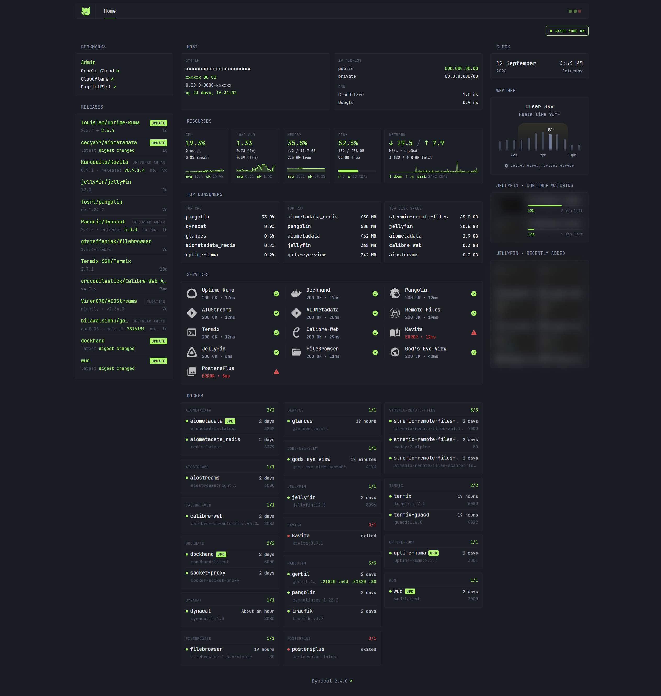
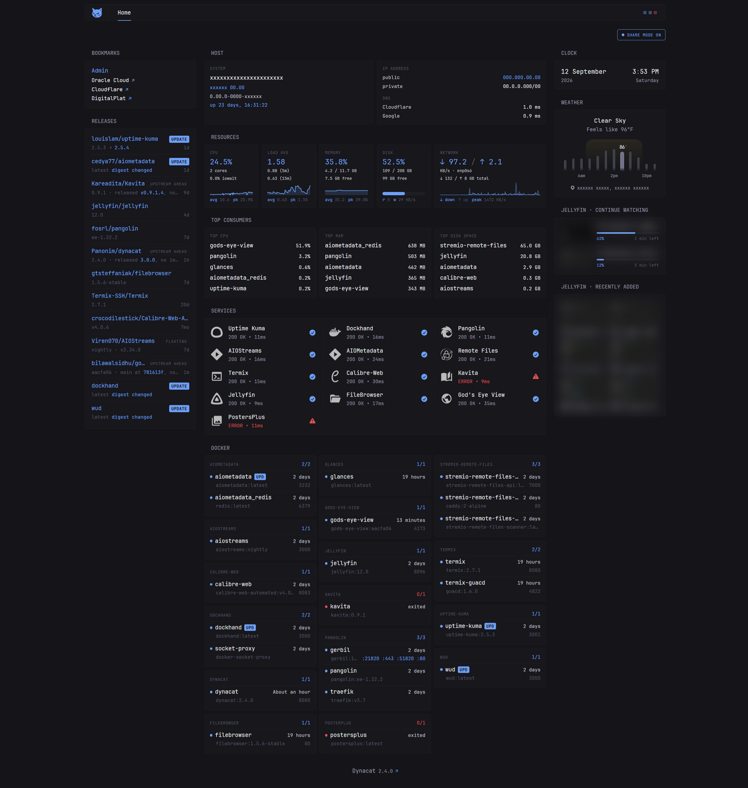
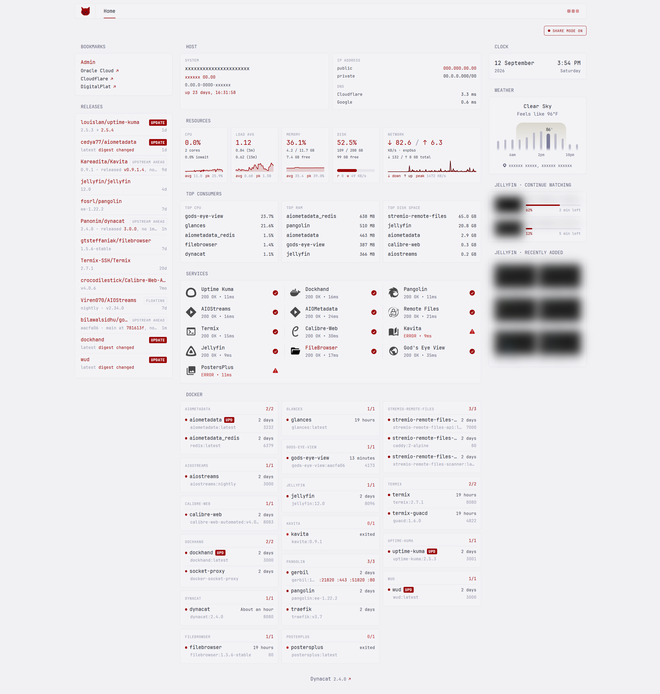

# Dynacat Dashboard - Self-hosted Homelab Layout

A [dynacat](https://github.com/Panonim/dynacat) config: host metrics with resources monitoring, docker stack status, container update badges, service uptime
monitor, and jellyfin continue-watching / recently-added.

<p align="center">
  
</p>

`config/dynacat.yml` ships three theme presets. Click a thumbnail for the
full-size shot.

<table align="center">
  <tr>
    <td align="center" width="33%"><a href="assets/theme-green-dark.png"></a></td>
    <td align="center" width="33%"><a href="assets/theme-blue-dark.png"></a></td>
    <td align="center" width="33%"><a href="assets/theme-red-light.png"></a></td>
  </tr>
  <tr>
    <td align="center"><code>green-dark</code></td>
    <td align="center"><code>blue-dark</code></td>
    <td align="center"><code>red-light</code></td>
  </tr>
</table>

## Setup

```sh
cp .env.example .env   # fill it in, every value is commented
docker compose up -d
```

Open `http://localhost:8080`.

## What each widget needs

Widgets fail independently: skip a dependency and only its widgets break.

| Widget | Needs |
|---|---|
| Host, Resources, Top Consumers | Glances with the web API on (`glances -w`), reachable at `GLANCES_HOST` (see below) |
| Docker, Releases | A Docker socket-proxy container named `socket-proxy` on a shared network |
| update badges (Docker, Releases) | [WUD](https://github.com/getwud/wud) named `wud` on a shared network |
| Releases | `GITHUB_TOKEN` |
| Jellyfin | `JELLYFIN_API_KEY` + `JELLYFIN_USER_ID`, Jellyfin named `jellyfin` on a shared network |
| Services | The listed containers on a shared network |

Widgets reach other services by **container name**, so dynacat must share a
Docker network with them.
Two lists are yours to fill in, they ship with placeholder examples, not a
real stack:

- `Services` (monitor widget): One block per service you want probed.
- `Releases`: Four parallel lists, `$svc` / `$repo` / `$name` / `$mode`. They
  must stay the same length and in the same order or rows pair with the wrong
  repo. `$mode` is `release` to track tags or `commit` to track `main`.

The `Docker` widget needs no such list: it discovers every container and groups
it by compose project automatically.

### Glances

`GLANCES_HOST` has no default that works everywhere, so it ships as
`CHANGEME:61208` and those three widgets show a connection error until you set
it. Two working setups:

- **Glances on the host**: Point at the gateway of the network this container
  joins, which for the shipped `compose.yaml` is `dynacat`:
  `docker network inspect dynacat -f '{{(index .IPAM.Config 0).Gateway}}'`.
  Glances must also *listen* on that address; a `127.0.0.1` bind is unreachable from a
  container.
- **Glances as a container on the same network**: Then it is just
  `glances:61208`, no gateway IPs involved. Note that a bridge-networked
  Glances reports the container's own network counters, so the Network tile
  will not show host traffic unless it runs with `network_mode: host`.

`ROOT_MOUNT` and `DISK_NAME` must match what *your* Glances reports, not what
the host calls them, check `curl $GLANCES_HOST/api/4/fs` if the Disk tile is
empty.

## Notes

- **Share mode.** The toggle top-right blurs hostnames, IPs, and media titles,
  and masks the weather location (for screenshots and screen-sharing). Pure
  CSS, no JavaScript.
- **Jellyfin auth** uses an `Authorization: MediaBrowser Token="..."` header.
  Jellyfin 12 rejects the older `?api_key=` query parameter.
